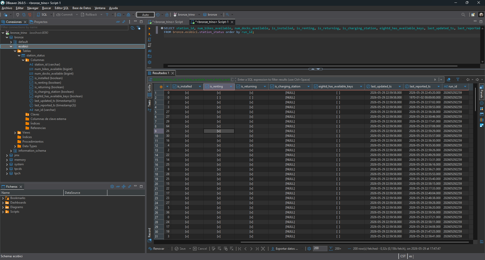

# Preguntas:   
## ¿Qué dataset se seleccionó para tu flujo? 
Se seleccionó el dataset station_status.json porque parecía el mas completo o con mas datos al momento de revisar las opciones y tambien se actualizaba con mas frecuencia.
 
## ¿Qué temporalidad se realizará la extracción? Explica por qué se seleccionó este timing. 
Seleccioné ahcerlo cada 10 minutos, realmente no queremos saber el status de la estación tan frecuente como cada 5 minutos, incluso 10 minutos es poco pero necesitaba datos y dejarlo corriendo un rato, lo ideal hubiera sido cada media hora y nos da una buena foto del estus de las estaciones 
 
## ¿Qué limpieza de datos usaste o crees que necesitaba los datos? 
Solo extraje los datos de json para tenerlo en formato tabular y hice un cambio en tipo de datos, los datos en realidad son consistentens
 
## ¿Qué propuesta de partición de ruta elegiste para el guardado de tu parquet y crees que esta partición afecta a Trino para su disponibilización automática de datos?  
Creé una nueva columna llamada run_id que practicamente es YYYYMMDDHHMM y con esto garantizo un nuevo path en cada ejecución. En un principio pensé que no, pero pasa lo mismo que cuando se hace una tabla en hive, se tiene que especificar que esta particionada sino los datos no se ven en automatico en trino. 
Ademas en cada carga hay una nueva partición por lo que hay que indicarle despues de cada nueva carga a trino
## ¿De todo el proceso, cuál fue el reto más grande? Explica el por qué 
Creo que solo la disponibilización de los datos en Trino porque no había indicado la partición y no veía los datos, despues recorde lo de hive y apliqué una logica similar y ya pude verlos 
