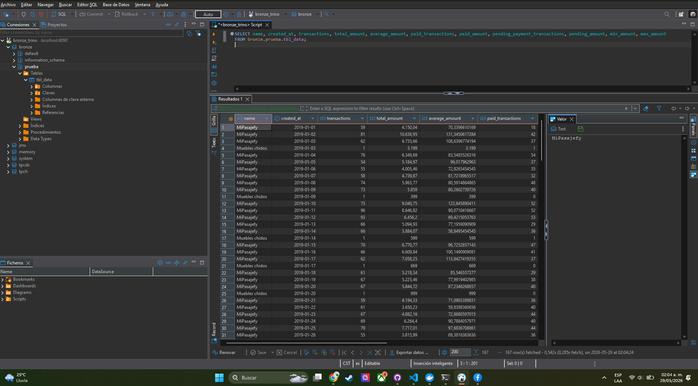

1. Para los ids nulos ¿Qué sugieres hacer con ellos ? 
    R. Para tema de analisis pueden servir sin embargo con el ID nulo no se pueden llevar tal cual existen en el archivo a una capasuperiro pensando que el ID es una llave primaria (y eso parece ya que los que existen son ids únicos). La propuesta es poder llevarlos con una llave nueva que no reempleze a la primaria pero que si lo haga unico al registro y conservar ambos datos, IDs y llave nueva. 
    Ademas agregar una bandera de "Is_Corrupted" en bool para poder filtrar a los registros con valores atípicos y generar um mejor analisis de esos valores ademas que esta bandera permitiría la facilidad de poder filtrarlos en caso de ser necesario
2. Considerando las columnas name y company_id ¿Qué inconsistencias notas y como las mitigas? 
    R. Hay valores nulos y valores corruptos. Sin embargo al haceruna relacion entre los valores no nulos y no corruptos parece haber una relacion entre company_id y name y que estan asociados uno a uno. Con esto en mente el facil asignar a los valores corruptos y nulos el valor correcto
3. Para el resto de los campos ¿Encuentras valores atípicos y de ser así cómo procedes?
    R. En el caso del estatus no tenemos forma de saber el valor correcto de los estatus corruptos, por lo que se optó por marcarlo con un nuevo estatus 'unknown' indicando que el valor se desconoce. 
    En el caso de los valores atípico de la columna Amount, algunos desde la tranformación a float se detenta que se van a "inf" por ser una cantidad demasiado grande aunque algunos otros a pesar de ser grande siguen apareciendo. Se hizo un análisis de quantil 99 para poder descartar aquellos registros con un valor muy grande en la agregagación. Sin embarque recomiendo que de existir una capa intermedia antes de la agregación esos valores se conserven y marcarlos como corruptos con la misma bandera qeu se sugiere en la pregunta numero 1.
4. ¿Qué mejoras propondrías a tu proceso ETL para siguientes versiones?
    a. Uso de una mejor paquetería, ahorita se trabajo en pandas por la facilidad de uso y por no tener disponible Spark, ademas por la cantidad de datos usar Spark es mucho para este pequeño analisis. Polar es la mejor opcion al estar entre pandas y spark.
    b. Crear una nueva capa de "datos curados" en el datalake en donde podemos guardar la información con nuevas banderas que nos indique los datos corruptos y tener un mejor análisis y no perderlos de vista
    c. En caso que la información aumente hacer ejecuciones delta con una columna de last_updated_at esto implica agregar una nueva columna a la tabla fuente, sin embargo no se debe asumimir que los campos created_at o paid_at se actualizan por cada actualización de los registros, parece que por el nombre solo se actualizan durante la creación o el pago. Hay que tenen en cuenta otras acción es como el cambio de estatus (no solo a pagado) y llevar el control de actualizaciones con el campo last_updated_at
5. Guardar una captura de pantalla como imagen, de la query con Trino usando DBeaver 
