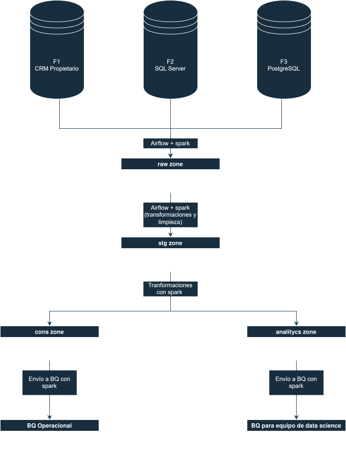

# Ejercicio 2 - Propuesta de arquitectura

## Propuesta general de arquitectura

Yo propondría una arquitectura tipo **lakehouse** en **GCP**, con estos componentes:

- **Airflow** para orquestación.
- **Spark** para extracción, limpieza, transformación, conformado y generación de features.
- **GCS** como almacenamiento de datos en bruto, intermedios e históricos.
- **BigQuery** como capa principal de consulta SQL para operación y analítica.
- Una capa opcional de grafos, en caso de que el caso de uso lo pida con más fuerza.

### Capas

1. **Ingesta**
   - Carga incremental desde F1, F2 y F3.
   - Persistencia de copias crudas en GCS.
   - Carga inicial por batches como primer paso.

2. **Raw**
   - Datos inmutables por fuente.
   - Conserva el estado exacto de lo que llegó.
   - Permite reprocesamiento y auditoría.

3. **Staging**
   - Limpieza, tipado, normalización de nombres y formatos.
   - Deduplicación y validaciones básicas.

4. **Conformada**
   - Integración semántica entre fuentes.
   - Llaves canónicas y entidades comunes.
   - Tablas listas para consultas operativas.

5. **Consumption**
   - Tablas optimizadas para SQL en BigQuery.
   - Vistas o tablas materializadas para usuarios del área operativa.
   - Variables derivadas para clustering, segmentación o modelado.
   - Datasets de consumo para ciencia de datos.

6. **Analytics**
   - Agregaciones por ventana de tiempo.
   - Ratios, flags, embeddings y conteos.
   - Transformaciones pensadas para modelos.

---

## 1. Propuesta de arquitectura

### 1a. Subconjunto a extraer de cada fuente

La extracción no debería traer toda la información de origen, sino únicamente los campos necesarios para el negocio, más llaves de integración y metadatos de trazabilidad, por ejemplo columnas temporales.

#### Justificación

No extraigo todo porque:

- incrementa el costo de procesamiento y almacenamiento.
- expone información que no hace falta.
- complica el modelado.
- y aumenta el impacto sobre los sistemas.

Además, al incluir llaves de origen y metadatos de carga puedo:

- trazar cada registro.
- deduplicar.
- reprocesar.
- y explicar el origen de cada dato.

---

### 1b. Retos de extracción por separado y herramientas

La extracción debe adaptarse al tipo de fuente.

#### F1 - CRM propietario

Posibles retos:

- tal vez no tengamos acceso SQL directo.
- puede exponer API con paginación o rate limits.
- puede tener un esquema propietario o poco estándar.

Herramientas sugeridas:

- Python para extracción vía API o conector del proveedor.
- Spark si la extracción se entrega como archivos o lotes grandes.
- Airflow para orquestación.
- snapshots incrementales si no hay CDC.

#### F2 - SQL Server

Posibles retos:

- bloqueo o impacto sobre producción.
- consultas pesadas en tablas grandes.
- extracción incremental.

Herramientas sugeridas:

- Spark con JDBC.
- CDC si está disponible.
- réplica de lectura si existe.
- Airflow para programar la ejecución en ventanas de bajo uso, de preferencia en la madrugada.

#### F3 - PostgreSQL

Posibles retos:

- control de incrementalidad.
- minimizar impacto en la fuente.

Herramientas sugeridas:

- Spark con JDBC.
- Airflow para orquestar el proceso diario.

#### Justificación

- API para el CRM.
- JDBC/CDC para los RDBMS.
- e ingesta incremental para todos.

Así el procesamiento se puede resolver con Spark y todo quedaría orquestado en Airflow.

---

### 1c. Retos por la independencia del modelo de datos y cómo resolverlos

Como las tres fuentes fueron diseñadas de forma independiente, los modelos probablemente no van a coincidir mucho. Por ejemplo:

- llaves primarias y naturales.
- nombres de columnas.
- granularidad.
- normalización.
- y reglas de negocio.

No conviene realizar una unión física de las tablas si los modelos no son compatibles.

#### Solución propuesta

1. Crear una **llave subrrogada canónica** para entidades comunes como cliente o producto.
2. Mantener **tablas de correspondencia** entre llaves de origen y llaves canónicas.
3. Definir una capa de **entidades/dimensiones**.
4. Mantener la información histórica.
5. Integrar en vistas o tablas de consumo solo cuando el join tenga sentido funcional.

#### Justificación

Esto permite:

- conservar el origen real de cada dato.
- simplificar la consulta de negocio.
- y mantener trazabilidad y consistencia semántica.

---

### 1d. Cómo mitigar el impacto sobre las fuentes originales

Además de ejecutar la ingesta en una ventana de menor uso, se puede mitigar con:

- **CDC o extracción incremental** en lugar de full scans diarios.
- lectura desde **réplicas de solo lectura** cuando sea posible.
- filtros por `updated_at`.
- proyección únicamente de columnas necesarias.

#### Justificación

La idea es no sobrecargar los sistemas ni generar bloqueos, manteniendo el proceso estable.

---

### 1e. Etapas del proceso de transformación

Yo lo separaría así:

1. **Raw**
   - copia inmutable del dato de origen.

2. **Staging**
   - limpieza.
   - deduplicación.
   - corrección de formatos.

3. **Conformada**
   - integración de entidades comunes.
   - llaves canónicas.
   - reglas de negocio compartidas.

4. **Consumption**
   - tablas listas para SQL operativo y data science, aunque sean datasets distintos.
   - agregados y vistas de consumo.

5. **Analytics**
   - tablas específicas para data science.

#### Justificación

Separar las etapas ayuda a controlar mejor la calidad, la trazabilidad y los costos.

---

### 1f. Herramientas para las etapas de transformación

Propongo usar:

- **Spark** para la transformación principal.
- **Airflow** para la orquestación.
- **BigQuery** para la capa SQL de consumo.

#### Justificación

Spark es adecuado para:

- joins complejos.
- normalización.
- deduplicación.
- historización.
- y generación de features.

Airflow coordina dependencias, reintentos, SLAs y cargas incrementales.

---

### 1g. Storage para cada propósito

#### Recomendación principal

- **GCS** para raw, landing y staging.
- **BigQuery** para operación SQL y analítica.
- **GCS + BigQuery** para la capa de ciencia de datos.

#### Justificación

GCS aporta:

- bajo costo.
- durabilidad.
- flexibilidad.
- y almacenamiento de históricos.

BigQuery aporta:

- SQL administrado.
- escalabilidad.
- separación entre almacenamiento y cómputo.
- y buen desempeño para usuarios operativos y analíticos.

#### Sobre grafos

Si el caso de uso de búsqueda en grafos es fuerte, conviene complementar con una base especializada para ese uso. En GCP existe BigQuery Graph Analytics, aunque no lo he usado anteriormente.

---

### 1h. Orquestación del pipeline

Usaría **Airflow** para orquestar todo el flujo.

---

### 1i. Diagrama lógico de la arquitectura

---

## 2. Seguridad

### 2a. ¿Cómo mantendría la seguridad del flujo end-to-end?

Mantendría la seguridad con estas prácticas:

- **Secret Manager de GCP** para credenciales, tokens y llaves.
- **IAM de mínimo privilegio** mediante service accounts separadas por componente.
- **Acceso por dataset, tabla y, cuando sea necesario, por columna o fila**.
- **Consultas parametrizadas y uso de listas blancas** para evitar inyección SQL cuando se generen queries dinámicas.
- **Redes privadas o de la empresa**, evitando exposición pública innecesaria.
- **Separación clara de ambientes** `dev` y `prod`.

#### Justificación

El flujo procesa información operativa y potencialmente sensible. Por eso se tiene que cuidar:

- credenciales.
- permisos.
- red.
- SQL.
- y exposición de datos.

La combinación de Secret Manager, IAM mínimo, aislamiento de red y control de accesos sobre BigQuery reduce bastante el riesgo de seguridad.

---

## 3. Gobernanza de datos

### 3a. ¿Cómo llevaría control de metadata, cambios y procesos del pipeline?

Actualmente la parte de gobernanza no la he tocado mucho, pero sí he trabajado una pieza importante para eso.

La propuesta sería crear un **snapshot diario** donde se almacene:

- esquema.
- nombre de tablas.
- fecha de carga.
- estado del dataset.
- columnas.
- tipos de dato.
- particiones.
- tamaño.
- número de filas.
- fecha de carga.
- definición funcional.
- dueño del dato.
- dominio.
- sensibilidad.
- uso esperado.
- permisos.

Esto se generaría con otro DAG diario que extraiga la información de GCS y guarde ese snapshot con dicha información.

#### Cómo lo almacenaría

Seguiría el mismo formato de capas:

- GCS para guardar información en raw y staging.
- y una tabla en consumption para consultar el snapshot.

A esa tabla solo tendrían acceso las personas con permisos suficientes.

 